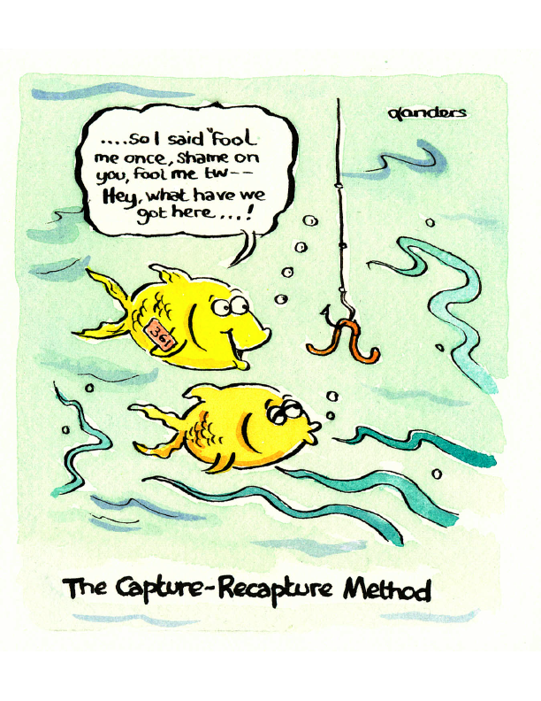
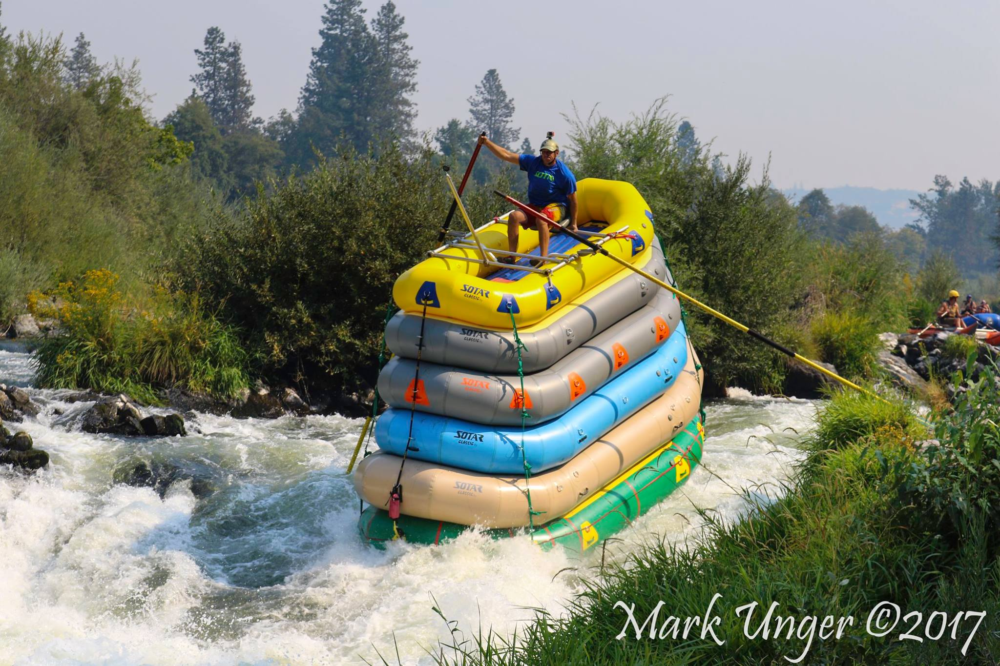

Why a review on capture-recapture?
=================================

I will be attending the [Wildlife Research and Conservation 2019
conference](http://www.izw-berlin.de/welcome-234.html) in Berlin end of
September. At the time I was proposed to come, I thought it’d be cool to
review recent advances in capture-recapture, which I have been thinking
to do for a while. Now time to actually do something. As a
capture-recapture aficionado, I have witnessed the awesomeness of
the last 10 years: clever methods have been developed and exciting
ecological questions have been asked and answered. Let’s have a look in more details
to the period 2009-2019.

Bibliometric and textual analyses
=================================

To determine the questions and methods folks have been interested
in, I searched for capture-recapture papers in the Web of Science. I
found more than 5000 relevant papers on the 2009-2019 period. These
papers are gathered in the file
[crdat.csv](https://github.com/oliviergimenez/capture-recapture-review/blob/master/crdat.csv).
To make sense of this big corpus, I carried out biliometric and textual
analyses in the spirit of [this
paper](https://www.cell.com/trends/ecology-evolution/fulltext/S0169-5347(18)30278-7). Explanations along with the code and results are [here](https://github.com/oliviergimenez/capture-recapture-review/blob/master/bibliometric_analysis.md). I also inspected a sample of methodological and ecological papers, see [there](https://github.com/oliviergimenez/capture-recapture-review/blob/master/make_sense.md) for more details. 

Below is a synthesis of my findings. I will add the references later on.

Ecological questions
====================

- In the 80s and 90s, there was a shift in emphasis from **abundance** estimation to **survival** estimation (Lebreton et al. 1992). Well, my general impression is that things are more balanced nowadays, with a lot of work on both topics. This is probably due to the uptake of spatial capture-recapture models and the possibility to produce density estimates and account for individual heterogeneity.

- The study of **dispersal** is a big deal, as well as **population growth**, **recruitment** and **stopover duration** in relation to migration; **species richness** is also of interest (big influence of A. Chao's work). Obviously, the study of survival remains the focus of much interest, in particular the consideration of competing risks and estimation of cause-specific mortality rates.

- There is been a growing interest in studying the **threats on biodiversity** by determining the impact of climate conditions and change, pollution, poaching, invasive species, habitat loss, deforestation, human infrastructure (road, power lines, wind turbine) or overexploitation (fishing, hunting) on animal demographic parameters and performance. 

- The field of **evolutionary ecology** has resorted to capture-recapture to quantify life-history trade-offs and costs, estimate heritability of demographic parameters, describe senescence patterns or assess selection gradients.

- In relation to the previous item, **individual heterogeneity** has become a focus of interest, and is no longer considered as a nuisance parameter only.

- The demographic component of interest varies according to animal class: in **birds**, the interest is in studying migration and breeding; in **fish**, folks are more into individual growth, movement and survival; in **marine mammals** and **large carnivores**, it is all about estimating abundance/density using photo-identification, camera-trapping and genetic tagging; 

- The field of **disease ecology** is using capture-recapture more and more for estimating prevalence, infection rates, studying transmission, exposure, etc...

- Lots of **different organisms** are studied: birds, mammals, fishes, insects, reptiles, amphibians, plants.

- How to **manage populations** (conservation, regulation, harvesting, reintroduction) is keeping folks busy: population size and population trends are used as ecological indicators.

- Ecologists are concerned about animal welfare and the **effects of marking on animals** and devote efforts to quantify these effects.

- Folks are using **genetic information** in new innovative ways to estimate demographic parameters (close-kin method, population assignment) 

Capture-recapture methods
=========================

- Note: By focusing on journals where folks mostly published, we might miss methodological papers in non common journals. For example, Cole and Choquet have published important work on identifiability that does not appear here. 

- **Non-invasive methods** have revolutionalized the field: photo-identification, acoustic, camera-trapping or genetic tagging. This has stimulated a lot of work on **identification issues** including misidentification, incomplete identification, partial identification, non-identification (dna not amplified, allelic dropout), missed matches (in photo-id).

- There has been an uptake of **hidden Markov models (HMM)** (possibly >1st order - memory), and models w/ **hidden
    variables** in general; we can deal w/ complexity and uncertainty, while having great
    flexibility in the modelling by i) distinguishing what we see, what we observe from what is actually going on and ii) 
    decomposing a complex problems in several simpler problems; note that HMM are a special case of **state-space models**, 
    and that multistate/multievent models are HMMs (shall we use only the HMM terminology?). 

- **Bayesian analyses** of capture-recapture data are quite common now: we can fit complex models with,
    e.g., random effects or a spatial component, and estimate latent variables (disease or breeding status in multistate 
    models, home ranges (activity centers) in spatial explicit models).

- **Spatially-explicit models** are a big deal, for closed and open population, in the frequentist and Bayes frameworks, and can help answering many ecological questions (see reviews by Borchers, Lamb et al. and Royle et al.).

- Capture-recapture is not only about individual identification, methods for **unmarked individuals** (N-mixture, occupancy, random-encounter, batch marking, and mark-resight models) are widely used to say something about abundance and demography.

- We can now consider **random effects** like in generalized mixed models (time random effects are still difficult to fit in a frequentist framework though).

- **Combination of information** makes a lof of sense, i) from different protocols like recaptures, recoveries or telemetry (not to be called 'integrated population models' in my opinion) and ii) using a matrix pop model at its core to combine individual- and population-level information in **integrated population models (IPM)** (not to be confused w/ integral projection models). In passing, I loved Andy Royle's tweet about his visual representation of an IPM:

- There has been some interest in developing methods for **continuous capture-recapture** to deal w/ opportunistic data or. data collected w/ remote sensors.

- Folks have spent a lot of energy on the issue of **heterogeneity** (individual, temporal). Often, mixtures or random effects are used if unobserved.

- As anticipated by Lebreton et al. (1992), how to properly deal with **covariates** has generated a lot of work (measurement error, missing data, flexible functional form, covariate selection, collinearity, indirect/direct effects).

- **Temporary emigration** is a serious concern (combine w/ telemetry data, use robust design, consider unobservable states).

- Folks devote a lot of energy in the **evaluation of methods** (often via simulations), thinking about assumptions, developing goodness-of-fit procedures.

- In relation to the previous item, the **lack of independence between individuals** is of interest, in particular for social species (random effects, social network, sampling design).

- There are huge efforts made to make methods available to ecologists via the development of computer programs, mainly **R packages**. 

Capture-recapture is dead, long live capture-recapture! 
===========================================================

In this section, I list a few thoughts I had while reading the corpus of papers. I try to answer the question "What do we miss?". I also provide my two cents insights and a few random throughts.

- **Data science** is the new kid on the block, and we could learn from it. It is said that 80% of the work of a data scientist is about cleaning, wrangling and preparing data. What about capture-recapture? To my knowledge, we don't talk much about anything that happens before the actual analysis. Shall we think of pipelines to build encounter histories? What about outliers? How to visualise the raw data? What about data archiving, versioning (updates over the years) and sharing?

- We are a bit short I think in terms of **designing capture-recapture protocols**: more work is probably needed on adaptive sampling, power analyses and providing ecologists w/ practical tools and recommandations. 

- New methods need to be evaluated (virtual ecologist approach ie w/ simulation, or empirically) - there is an actual niche there.

- There have been tremedous efforts to build **databases in demography** (e.g. [comadre](http://www.comadre-db.org/)). I know of several initiatives to gather demographic parameters, which should be pursued. Such databases would be useful to carry out meta-analyses (e.g. the effects of climate on survival) in the framework of comparative demography.

- The field is centered on populations; some work is done on communities (species interactions), more to come hopefully.

- There is a **replication and reproducibility crisis** in science and ecology in particular. Where do we stand in capture-recapture? 

- The field is mainly about correlative studies; can we have more experimental studies using capture-recapture (is it actually relevant?)?

- **Cross-fertilization with other disciplines** happens (between ecology, statistics, social and medical sciences) and should be pursued. A few ideas:
    - Data are getting bigger and bigger (shall I dare using the word Big data?). **Computer scientists** could be enroled to think of parallelisation, cloud computing, improved MCMC algorithms (the Nimble team efforts are great in that respect), etc... Probably already the case. 
    - The expertise of **social scientists** could be used to improve the modeling of detection, in particular in citizen science programs to better understand motivation, heterogeneities, etc.
    - In the frequentist framework, model (and covariate) selection is mainly accomplished w/ AIC; regularisation tools (e.g. Lasso or boosting) could be explored further, with the help of machine learning specialists. Regarding the Bayesian framework, efforts have been made to review and explain methods. The insight of **statisticians** is obviously important here.
    - Folks are beginning to use deep learning to identify species and individuals on camera-trap images; would it be useful for genetic tagging? **AI scientists** help is needed.
    - Wildlife monitoring technology (e.g. eDNA, bioacoustics, drones) is rapidly evolving, and methods need to keep up. In passing, technology may be animal inspired, e.g. detection dogs. Fielwork will remain key and the input of **naturalists** essential.
    - There has been several calls for making ecology more predictive, in particular in the context of the impacts of global changes on biodiversity. Capture-recapture contributes to the collective effort by providing the ingredients for demographic projections. Here I guess collaboration with **climate scientists** should be encouraged (and are already happening).

- In their landmark 1992 Ecol Monog paper, Lebreton et al. predicted new developments in the field, and they did a damn good job at it! We pretty much have been doing what they anticipated in the last decade (walking in the footsteps of giants...)

- Clearly, **workshops and conferences** (like EURING or ISEC) are important to disseminate methods, foster new collaborations and build a friendly and inclusive community.

- A plethora of software exist: E-SURGE, MARK, marked, etc; we don't necessarily need the mother-of-all (reference to a paper by Matt and Richard) program, diversity is nice, but I guess at some stage we'll need a taxonomy (even though it'll be quickly outdated). Also, we need to thank developers who invest time in building these tools.

- It might be because I'm getting old, but sometimes I feel like we reinvent the wheel. Always a good experience to read the classics: Cormack, Jolly, Seber, Arnason, Brownie, Chao, Lebreton, Otis and many others (nice to see that the sex-ratio is more balanced nowadays). I find it also inspirational for my writing. 
    
- When it comes to determine the effects of time-varying covariates (e.g. climatic conditions), we need to remember that we have relatively short time-series and that it might be difficult to detect anything (see review by Morten Frederiksen).

- In relation the previous item, we will never say it often enough: long-term monitoring are so so important (see TREE paper by Sheldon and Clutton-Brock and recent ARES paper by Reinke, Miller and Janzen). Always worht thinking of adaptive monitoring, and the motto 'learning while doing'. 
        
- Methods are getting more and more complex (true?), and this should be reflected in the training we give to our students: how to teach spatial statistics, point process, HMM, Bayesian thinking, mixed models on top of everything else?

- What I really like w/ capture-recapture (and science in general I guess) is that you can work with folks from (almost) anywhere in the world on basically anything you'd like: ecology or statistics; terrestrial or marine species; plants (yes!), insects, birds, fishes, mammals (including humans), reptiles, amphibians; conservation biology, population management, behavioral ecology, evolutionary ecology, population dynamics, population genetics, etc.

Some useful quotes
=================

> Even the most general mathematical model is a plaything relative to the complexity of an animal population (Cormack 1968 cited in Lebreton et al. 1992).
Some 
> Counting fish is just like counting trees — except that they are invisible and keep moving (John Sheperd; [original statement](http://jgshepherd.com/thoughts/) a bit different)

> An applied statistician knowledgeable in capture-recapture should often be consulted for both the design and analysis of capture-recapture or capture-resighting studies, especially if the population issues are complex. (Lebreton et al. 1992)
