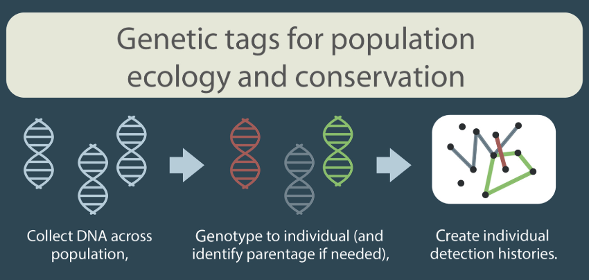

Why a review on capture-recapture
=================================

I will be attending the [Wildlife Research and Conservation 2019
conference](http://www.izw-berlin.de/welcome-234.html) in Berlin end of
September. At the time I was proposed to come, I thought it’d be cool to
review recent advances in capture-recapture, which I have been thinking
to do for a while. Now time to actually do something. I am a
capture-recapture aficionado, and I have witnessed the awesomeness of
the last 10 years with clever methods being developed and exciting
ecological questions being addressed. Let’s have a look in more details
to the period 2009-2019.

Bibliometric and textual analyses
=================================

To determine the questions and methods colleagues have been interested
in, I searched for capture-recapture papers in the Web of Science. I
found more than 5000 relevant papers on the 2009-2019 period. These
papers are gathered in the file
[crdat.csv](https://github.com/oliviergimenez/capture-recapture-review/blob/master/crdat.csv).
To make sense of this big corpus, I carried out biliometric and textual
analyses in the spirit of [this
paper](https://www.cell.com/trends/ecology-evolution/fulltext/S0169-5347(18)30278-7).
I also inspected a sample of methodological and ecological papers. More
explanations along with the code and results are
[here](https://github.com/oliviergimenez/capture-recapture-review/blob/master/bibliometric_analysis.md).
Below is a synthesis of my findings.

Ecological questions
====================

-   What are the fields interested by capture-recapture?

-   Question 1: **Dispersal** w/ Hugo’s review, papers by Jean-Do;
    papiers Paméla

-   Question 2: If interest in **climate change**, ok, mais attention,
    nb occz is nb annees (cf Frederiksen). Du coup deux reflexions :
    -   long-term monitoring (paper Sheldon et Clutton-Brock. Nichols)
    -   IPM et go for adaptive monitoring et management; learning while
        doing
-   Question 3: Life-history trade-offs

Capture-recapture methods
=========================

-   Method 1: uptake of hidden Markov models, and models w/ **hidden
    variables**; turning point w/ realization of hidden structure
    (partially-observed process - graph of HMM). State-space and HMM.
    Why? Deal w/ complexity and uncertainty, while offering great
    flexibility by decomposing obs vs state! Multistate (Lebreton) and
    multievent (Pradel) are actually HMM (particular case of SSM), and I
    recommend we use this terminology as tools are readily available.
    (Le fils tue le pere 💀)

-   Method 2: **Bayes analysis**: we now can fit complex models with,
    e.g., random effects or spatial component and estimate latent
    variables (disease or breeding status in multistate models, home
    range (activity) centers in spatial explicit models)

-   Method 3: **spatial capture-recapture**

-   Method 4: Importance of methods for **unmarked individuals**
    (N-mixture, occupancy, mark-resight)

-   Method 5: **Random effects**

-   Method 6: Combination of information! **Integrated population
    models** as seen by Andy Royle:

-   Method 7: **Continuous capture-recapture**? Opportunist data?
    Citizen science data?

-   Method 8: **Non-invasive methods** - Genetics: see excellent paper
    by C.T. Lamb
    <a href="https://esajournals.onlinelibrary.wiley.com/doi/full/10.1002/eap.1876" class="uri">https://esajournals.onlinelibrary.wiley.com/doi/full/10.1002/eap.1876</a>
    ; see also review by Andy in Ecography + Camera-traps.

What do we miss?
================

-   Sampling design: Model- and design-based design (adaptive sampling
    proposed, power analyses)

-   A proper treatment of missing and censored data

-   Population dynamics to be coupled with movement ecology,
    ecophysiology, etc; see figure in network paper by Réale in which
    capture-recapture cluster à part… Foster collaboration.

Capture-recapture is dead, long live the capture-recapture!
===========================================================

-   eDNA

-   multispecies

-   machine learning

-   social sciences to improve detection (cf papier X Lambin)

-   technology doesn’t have to be about mechanic, organic as well,
    e.g. detection dogs (mettre def technologie, et photo iris ours
    phyrénées)

-   Marking evolves: DNA, cameras, acoustics, drone. Methods need to
    keep up.

-   Big data? Citizen science protocols? Improve MCMC - Nimble? Stan?
    TMB?

-   Voir mon repertoire futur

Recommandations (if I may)
==========================

-   New methods need to be evaluated - there is an actual niche there

-   Importance of **workshops** to disseminate and form new
    collaborations

-   A plethora of **software**: E-SURGE, MARK, marked, etc; some
    homogeneization, importance of portage in R, how to value the work
    of these folks investing months and years in this.

-   Don’t reinvent the wheel - read your classics: Lebreton. Cormack.
    Jolly. Arnason. Otis.

Take-home message
=================
