Bibliometric and textual analyses of the 2009-2019 corpus of capture-recapture scientific papers
---

Introduction
------------

In this document, I carry out a bibliometric analysis of the
capture-recapture literature over the last 10 years. To do so, I follow
the excellent [vignette of the `R` bibliometrix
package](http://htmlpreview.github.io/?https://github.com/massimoaria/bibliometrix/master/vignettes/bibliometrix-vignette.html).
I also carry out a text analysis using topic modelling; I followed the steps [here](https://yufree.cn/en/2017/07/07/text-mining/) and checked the [Text Mining with R](https://www.tidytextmining.com/) excellent book many times. 

Data collection
---------------

To collect the data, I use the following settings:

-   Data source: Clarivate Analytics Web of Science
    (<a href="http://apps.webofknowledge.com" class="uri">http://apps.webofknowledge.com</a>)
-   Data format: Plain text
-   Query: capture-recapture OR mark-recapture OR capture-mark-recapture
    in Topic (search in title, abstract, author, keywords, and more)
-   Timespan: 2009-2019
-   Document Type: Articles
-   Query data: 5 August, 2019

Load the packages we will need

``` r
library(bibliometrix) # bib analyses
library(quanteda) # textual data analyses
library(tidyverse) # manipulation and viz data
library(tidytext) # handle text
library(topicmodels) # topic modelling
```

Read in and format the data.

``` r
# Loading txt or bib files into R environment
D <- readFiles("data/savedrecs.txt",
               "data/savedrecs(1).txt",
               "data/savedrecs(2).txt",
               "data/savedrecs(3).txt",
               "data/savedrecs(4).txt",
               "data/savedrecs(5).txt",
               "data/savedrecs(6).txt",
               "data/savedrecs(7).txt",
               "data/savedrecs(8).txt",
               "data/savedrecs(9).txt",
               "data/savedrecs(10).txt")

# Converting the loaded files into a R bibliographic dataframe
# (takes a minute or two)
M <- convert2df(D, dbsource="wos", format="plaintext")
```

    ## 
    ## Converting your wos collection into a bibliographic dataframe
    ## 
    ## Articles extracted   100 
    ## Articles extracted   200 
    ## Articles extracted   300 
    ## Articles extracted   400 
    ## Articles extracted   500 
    ## Articles extracted   600 
    ## Articles extracted   700 
    ## Articles extracted   800 
    ## Articles extracted   900 
    ## Articles extracted   1000 
    ## Articles extracted   1100 
    ## Articles extracted   1200 
    ## Articles extracted   1300 
    ## Articles extracted   1400 
    ## Articles extracted   1500 
    ## Articles extracted   1600 
    ## Articles extracted   1700 
    ## Articles extracted   1800 
    ## Articles extracted   1900 
    ## Articles extracted   2000 
    ## Articles extracted   2100 
    ## Articles extracted   2200 
    ## Articles extracted   2300 
    ## Articles extracted   2400 
    ## Articles extracted   2500 
    ## Articles extracted   2600 
    ## Articles extracted   2700 
    ## Articles extracted   2800 
    ## Articles extracted   2900 
    ## Articles extracted   3000 
    ## Articles extracted   3100 
    ## Articles extracted   3200 
    ## Articles extracted   3300 
    ## Articles extracted   3400 
    ## Articles extracted   3500 
    ## Articles extracted   3600 
    ## Articles extracted   3700 
    ## Articles extracted   3800 
    ## Articles extracted   3900 
    ## Articles extracted   4000 
    ## Articles extracted   4100 
    ## Articles extracted   4200 
    ## Articles extracted   4300 
    ## Articles extracted   4400 
    ## Articles extracted   4500 
    ## Articles extracted   4600 
    ## Articles extracted   4700 
    ## Articles extracted   4800 
    ## Articles extracted   4900 
    ## Articles extracted   5000 
    ## Articles extracted   5022 
    ## Done!
    ## 
    ## 
    ## Generating affiliation field tag AU_UN from C1:  Done!

Export back as a csv for further inspection:

``` r
M %>% 
  mutate(title = tolower(TI), 
         abstract = tolower(AB),
         authors = AU,
         journal = SO,
         keywords = tolower(DE)) %>%
  select(title, keywords, journal, authors, abstract) %>%
  write_csv("crdat.csv")
```

Data description
----------------

I ended up with 5022 articles. Note that WoS only allows 500 items to be
exported at once, therefore I had to repeat the same operation multiple
times.

### Web of Science graphs

WoS provides the user with a bunch of graphs, let’s have a look.

Research areas are: 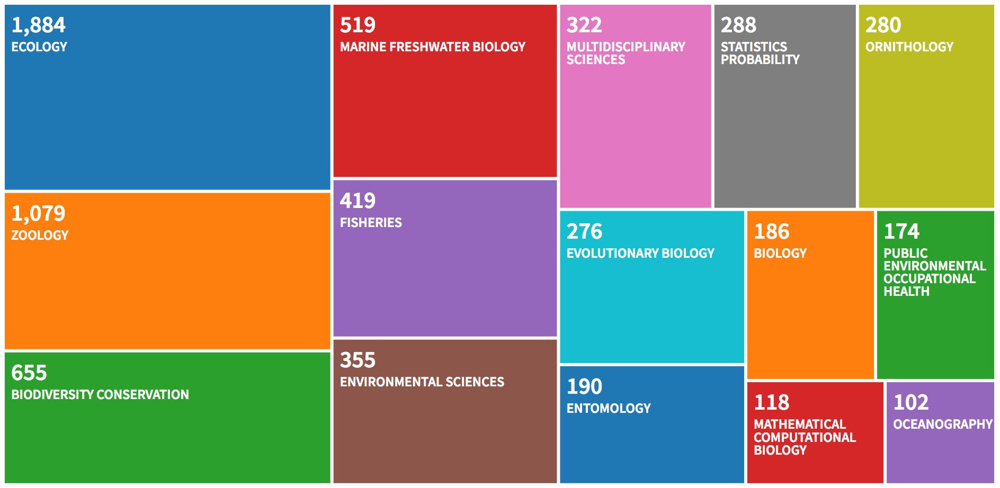

The number of publications per year is: 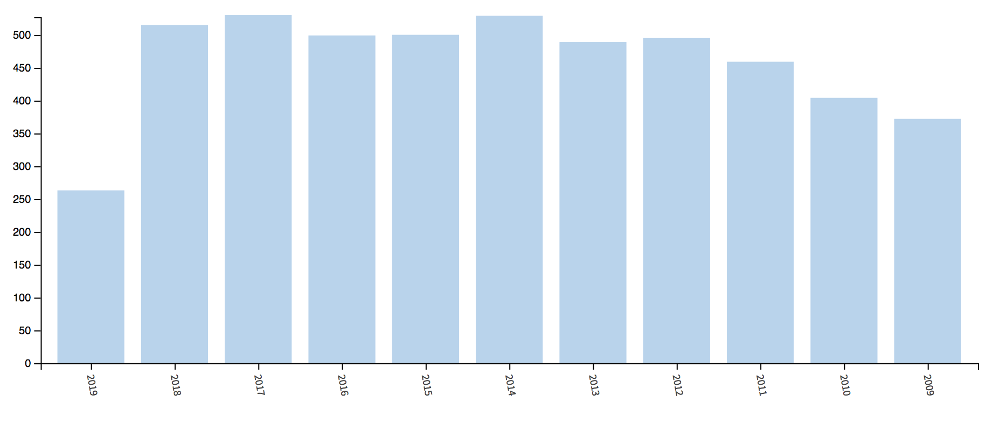

The countries of the first author are: 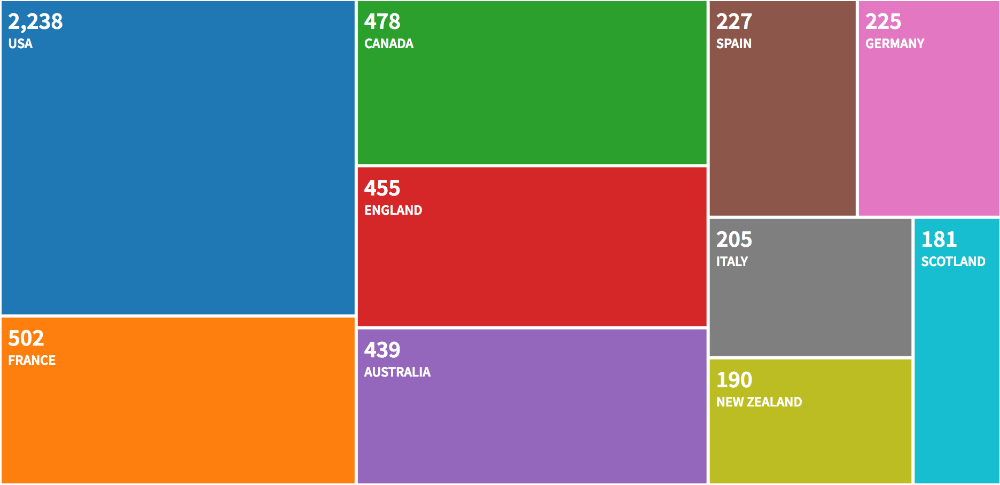

The journals are: 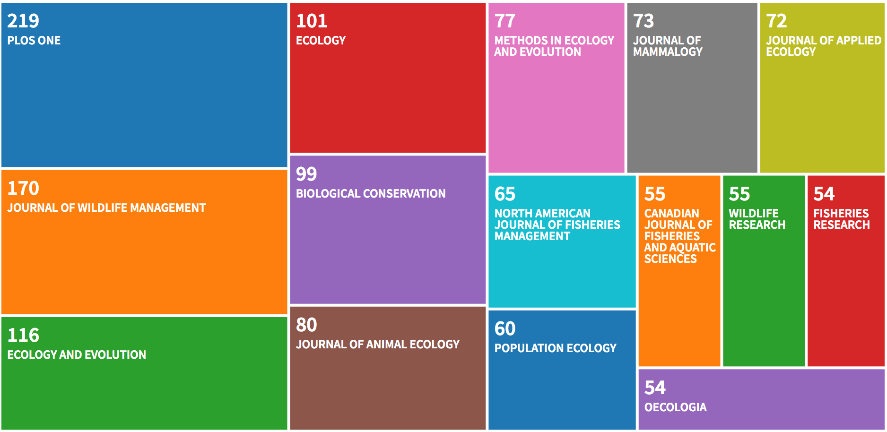

The most productive authors are: 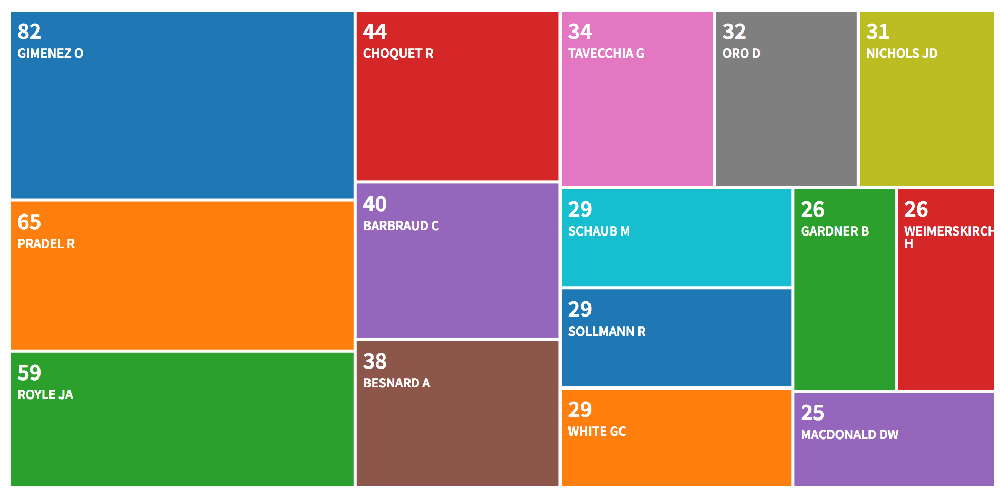

The graphs for the dataset of citing articles (who uses and what
capture-recapture are used for) show the same patterns as the dataset of
published articles, except for the journals. There are a few different
journals from which a bunch of citations are coming from, namely
Biological Conservation, Scientific Reports, Molecular Ecology and
Proceedings of the Royal Society B - Biological Sciences:
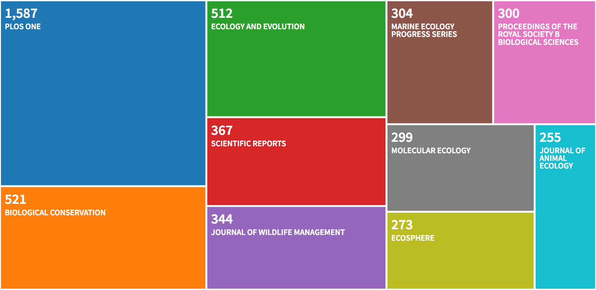

### `R` graphs

Let’s have a look to the data with `R`.

Number of papers per journal

``` r
dat <- as_tibble(M)
dat %>%
  group_by(SO) %>%
  count() %>%
  filter(n > 50) %>%
  ggplot(aes(reorder(SO, n), n)) +
  geom_col() +
  coord_flip() +
  labs(title = "Nb of papers per journal")
```

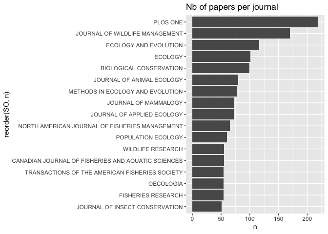

Wordcloud

``` r
dat$abstract <- tm::removeWords(dat$AB, stopwords("english"))
abs_corpus <- corpus(dat$abstract)
abs_dfm <- dfm(abs_corpus, remove = stopwords("en"), remove_numbers = TRUE, remove_punct = TRUE)
textplot_wordcloud(abs_dfm, min_count = 1500)
```

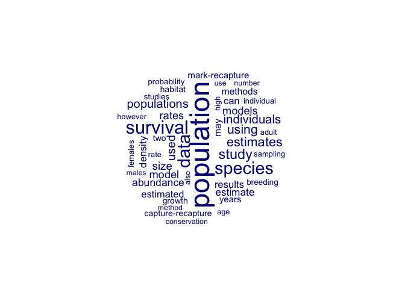

Most common words in titles

``` r
wordft <- dat %>%
  mutate(line = row_number()) %>%
  filter(nchar(TI) > 0) %>%
  unnest_tokens(word, TI) %>%
  anti_join(stop_words) 
```

    ## Joining, by = "word"

``` r
wordft %>%
  count(word, sort = TRUE)
```

    ## # A tibble: 9,348 x 2
    ##    word           n
    ##    <chr>      <int>
    ##  1 population  1136
    ##  2 recapture    800
    ##  3 survival     646
    ##  4 capture      556
    ##  5 estimating   362
    ##  6 data         361
    ##  7 abundance    355
    ##  8 mark         343
    ##  9 size         315
    ## 10 density      299
    ## # … with 9,338 more rows

``` r
wordft %>%
  count(word, sort = TRUE) %>%
  filter(n > 200) %>%
  mutate(word = reorder(word, n)) %>%
  ggplot(aes(word, n)) +
  geom_col() +
  xlab(NULL) +
  coord_flip()
```

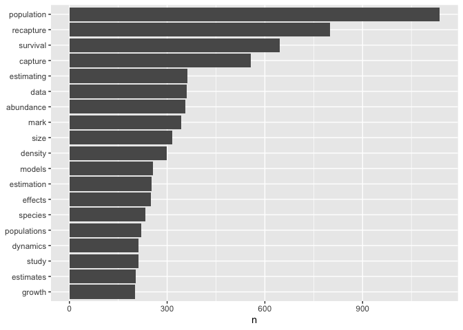

``` r
  labs(title = "Most common words in titles")
```

    ## $title
    ## [1] "Most common words in titles"
    ## 
    ## attr(,"class")
    ## [1] "labels"

Most common words in abstracts

``` r
wordab <- dat %>%
  mutate(line = row_number()) %>%
  filter(nchar(AB) > 0) %>%
  unnest_tokens(word, AB) %>%
  anti_join(stop_words) 
```

    ## Joining, by = "word"

``` r
wordab %>%
  count(word, sort = TRUE)
```

    ## # A tibble: 33,339 x 2
    ##    word            n
    ##    <chr>       <int>
    ##  1 population   9456
    ##  2 recapture    5760
    ##  3 survival     5742
    ##  4 species      5438
    ##  5 data         5366
    ##  6 capture      4158
    ##  7 study        4100
    ##  8 estimates    3660
    ##  9 mark         3434
    ## 10 individuals  3385
    ## # … with 33,329 more rows

``` r
wordab %>%
  count(word, sort = TRUE) %>%
  filter(n > 1500) %>%
  mutate(word = reorder(word, n)) %>%
  ggplot(aes(word, n)) +
  geom_col() +
  xlab(NULL) +
  coord_flip()
```


``` r
  labs(title = "Most common words in abstracts")
```

    ## $title
    ## [1] "Most common words in abstracts"
    ## 
    ## attr(,"class")
    ## [1] "labels"

Bibliometric analyses
---------------------

Now we turn to a more detailed analysis of the published articles. First
calculate the main bibliometric measures:

``` r
results <- biblioAnalysis(M, sep = ";")
options(width=100)
S <- summary(object = results, k = 10, pause = FALSE)
```

    ## 
    ## 
    ## Main Information about data
    ## 
    ##  Documents                             5022 
    ##  Sources (Journals, Books, etc.)       808 
    ##  Keywords Plus (ID)                    10728 
    ##  Author's Keywords (DE)                10943 
    ##  Period                                2009 - 2019 
    ##  Average citations per documents       11.54 
    ## 
    ##  Authors                               15128 
    ##  Author Appearances                    23004 
    ##  Authors of single-authored documents  174 
    ##  Authors of multi-authored documents   14954 
    ##  Single-authored documents             201 
    ## 
    ##  Documents per Author                  0.332 
    ##  Authors per Document                  3.01 
    ##  Co-Authors per Documents              4.58 
    ##  Collaboration Index                   3.1 
    ##  
    ##  Document types                     
    ##  ARTICLE                         4940 
    ##  ARTICLE; BOOK CHAPTER           6 
    ##  ARTICLE; EARLY ACCESS           7 
    ##  ARTICLE; PROCEEDINGS PAPER      69 
    ##  
    ## 
    ## Annual Scientific Production
    ## 
    ##  Year    Articles
    ##     2009      369
    ##     2010      401
    ##     2011      456
    ##     2012      492
    ##     2013      486
    ##     2014      526
    ##     2015      497
    ##     2016      496
    ##     2017      527
    ##     2018      512
    ##     2019      253
    ## 
    ## Annual Percentage Growth Rate -3.703741 
    ## 
    ## 
    ## Most Productive Authors
    ## 
    ##    Authors        Articles Authors        Articles Fractionalized
    ## 1     GIMENEZ O         82     GIMENEZ O                    17.95
    ## 2     PRADEL R          65     ROYLE JA                     15.92
    ## 3     ROYLE JA          59     PRADEL R                     12.82
    ## 4     CHOQUET R         44     BOHNING D                    10.78
    ## 5     BARBRAUD C        40     CHOQUET R                     9.91
    ## 6     BESNARD A         38     BARBRAUD C                    9.12
    ## 7     TAVECCHIA G       34     WHITE GC                      7.84
    ## 8     ORO D             32     SCHAUB M                      7.78
    ## 9     NICHOLS JD        31     KING R                        7.69
    ## 10    SCHAUB M          29     BESNARD A                     7.51
    ## 
    ## 
    ## Top manuscripts per citations
    ## 
    ##                             Paper           TC TCperYear
    ## 1  CHOQUET R, 2009, ECOGRAPHY              414      41.4
    ## 2  WHITEHEAD H, 2009, BEHAV ECOL SOCIOBIOL 350      35.0
    ## 3  LUIKART G, 2010, CONSERV GENET          289      32.1
    ## 4  GLANVILLE J, 2009, P NATL ACAD SCI USA  251      25.1
    ## 5  PATTERSON CC, 2012, DIABETOLOGIA        237      33.9
    ## 6  WALLACE BP, 2010, PLOS ONE              207      23.0
    ## 7  GOMEZ P, 2011, SCIENCE                  195      24.4
    ## 8  MERTES PM, 2011, J ALLERGY CLIN IMMUN   165      20.6
    ## 9  ROYLE JA, 2009, ECOLOGY                 158      15.8
    ## 10 SOMERS EC, 2014, ARTHRITIS RHEUMATOL    156      31.2
    ## 
    ## 
    ## Corresponding Author's Countries
    ## 
    ##           Country Articles   Freq  SCP MCP MCP_Ratio
    ## 1  USA                1766 0.3530 1432 334     0.189
    ## 2  UNITED KINGDOM      322 0.0644  185 137     0.425
    ## 3  AUSTRALIA           321 0.0642  202 119     0.371
    ## 4  FRANCE              311 0.0622  197 114     0.367
    ## 5  CANADA              305 0.0610  198 107     0.351
    ## 6  SPAIN               161 0.0322   95  66     0.410
    ## 7  ITALY               151 0.0302   89  62     0.411
    ## 8  GERMANY             147 0.0294   66  81     0.551
    ## 9  NEW ZEALAND         131 0.0262   72  59     0.450
    ## 10 BRAZIL              128 0.0256   95  33     0.258
    ## 
    ## 
    ## SCP: Single Country Publications
    ## 
    ## MCP: Multiple Country Publications
    ## 
    ## 
    ## Total Citations per Country
    ## 
    ##       Country      Total Citations Average Article Citations
    ## 1  USA                       21863                     12.38
    ## 2  FRANCE                     4395                     14.13
    ## 3  UNITED KINGDOM             4382                     13.61
    ## 4  AUSTRALIA                  3719                     11.59
    ## 5  CANADA                     3466                     11.36
    ## 6  GERMANY                    2005                     13.64
    ## 7  NEW ZEALAND                1922                     14.67
    ## 8  ITALY                      1599                     10.59
    ## 9  SWITZERLAND                1491                     21.30
    ## 10 SPAIN                      1437                      8.93
    ## 
    ## 
    ## Most Relevant Sources
    ## 
    ##                                    Sources        Articles
    ## 1  PLOS ONE                                            219
    ## 2  JOURNAL OF WILDLIFE MANAGEMENT                      170
    ## 3  ECOLOGY AND EVOLUTION                               116
    ## 4  ECOLOGY                                             101
    ## 5  BIOLOGICAL CONSERVATION                              99
    ## 6  JOURNAL OF ANIMAL ECOLOGY                            80
    ## 7  METHODS IN ECOLOGY AND EVOLUTION                     77
    ## 8  JOURNAL OF MAMMALOGY                                 73
    ## 9  JOURNAL OF APPLIED ECOLOGY                           72
    ## 10 NORTH AMERICAN JOURNAL OF FISHERIES MANAGEMENT       65
    ## 
    ## 
    ## Most Relevant Keywords
    ## 
    ##    Author Keywords (DE)      Articles Keywords-Plus (ID)     Articles
    ## 1     MARK RECAPTURE              722      SURVIVAL               647
    ## 2     CAPTURE RECAPTURE           475      CONSERVATION           525
    ## 3     SURVIVAL                    326      CAPTURE RECAPTURE      497
    ## 4     CAPTURE MARK RECAPTURE      247      ABUNDANCE              494
    ## 5     ABUNDANCE                   173      POPULATION             491
    ## 6     POPULATION DYNAMICS         145      MARKED ANIMALS         404
    ## 7     DEMOGRAPHY                  140      SIZE                   371
    ## 8     DISPERSAL                   138      POPULATIONS            339
    ## 9     CONSERVATION                131      MARK RECAPTURE         328
    ## 10    POPULATION SIZE             125      DYNAMICS               302

Visualize

``` r
plot(x = results, k = 10, pause = FALSE)
```

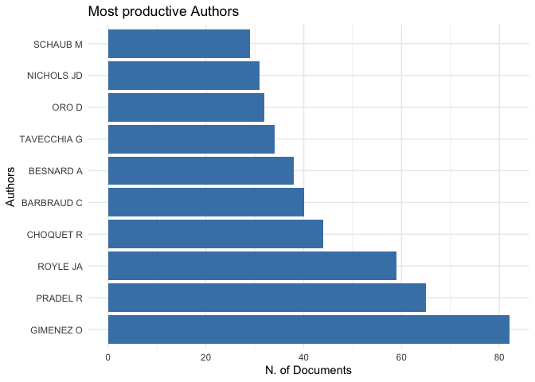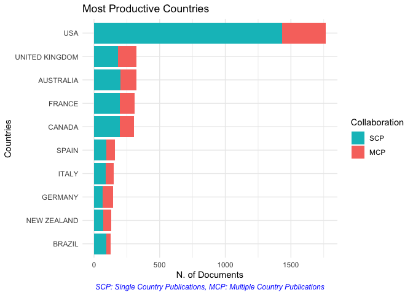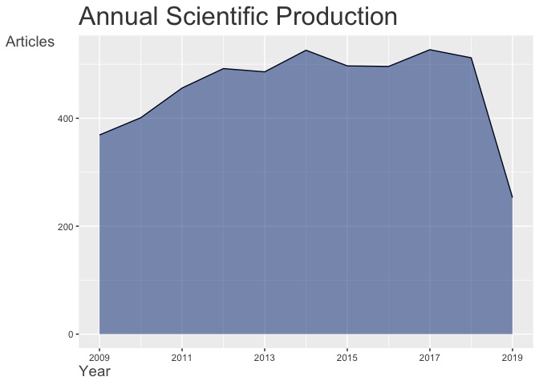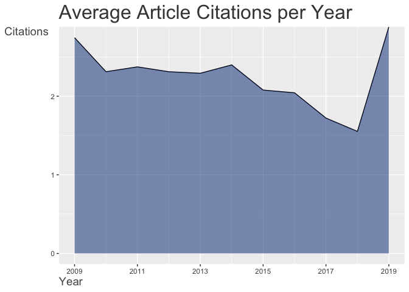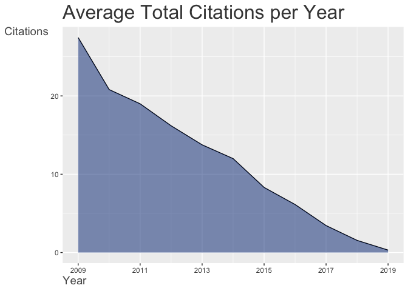

The 100 most frequent cited manuscripts:

``` r
CR <- citations(M, field = "article", sep = ";")
cbind(CR$Cited[1:100])
```

    ##                                                                                                 [,1]
    ## WHITE GC, 1999, BIRD STUDY, V46, P120                                                           1310
    ## BURNHAM K, 2002, MODEL SELECTION MULT                                                           1131
    ## LEBRETON JD, 1992, ECOL MONOGR, V62, P67, DOI 10.2307/2937171                                    835
    ## WILLIAMS B. K., 2002, ANAL MANAGEMENT ANIM                                                       546
    ## OTIS DL, 1978, WILDLIFE MONOGR, P1                                                               536
    ## JOLLY GM, 1965, BIOMETRIKA, V52, P225, DOI 10.1093/BIOMET/52.1-2.225                             368
    ## SEBER GAF, 1965, BIOMETRIKA, V52, P249                                                           320
    ## CHOQUET R, 2009, ECOGRAPHY, V32, P1071, DOI 10.1111/J.1600-0587.2009.05968.X                     313
    ## SEBER GA, 1982, ESTIMATION ANIMAL AB                                                             306
    ## KENDALL WL, 1997, ECOLOGY, V78, P563                                                             277
    ## BORCHERS DL, 2008, BIOMETRICS, V64, P377, DOI 10.1111/J.1541-0420.2007.00927.X                   265
    ## CORMACK RM, 1964, BIOMETRIKA, V51, P429, DOI 10.1093/BIOMET/51.3-4.429                           243
    ## POLLOCK KH, 1982, J WILDLIFE MANAGE, V46, P752, DOI 10.2307/3808568                              233
    ## EFFORD M, 2004, OIKOS, V106, P598, DOI 10.1111/J.0030-1299.2004.13043.X                          228
    ## PRADEL R, 1996, BIOMETRICS, V52, P703, DOI 10.2307/2532908                                       217
    ## KARANTH KU, 1998, ECOLOGY, V79, P2852                                                            214
    ## CASWELL H., 2001, MATRIX POPULATION MO                                                           203
    ## HUGGINS RM, 1989, BIOMETRIKA, V76, P133, DOI 10.1093/BIOMET/76.1.133                             203
    ## POLLOCK KH, 1990, WILDLIFE MONOGR, P1                                                            203
    ## SCHWARZ CJ, 1996, BIOMETRICS, V52, P860, DOI 10.2307/2533048                                     201
    ## PRADEL R, 2005, BIOMETRICS, V61, P442, DOI 10.1111/J.1541-0420.2005.00318.X                      196
    ## BROWNIE C, 1993, BIOMETRICS, V49, P1173, DOI 10.2307/2532259                                     195
    ## HOOK EB, 1995, EPIDEMIOL REV, V17, P243, DOI 10.1093/OXFORDJOURNALS.EPIREV.A036192               193
    ## CHOQUET R, 2009, ENVIRON ECOL STAT SE, V3, P845, DOI 10.1007/978-0-387-78151-8_39                185
    ## PRADEL R, 1997, BIOMETRICS, V53, P60, DOI 10.2307/2533097                                        185
    ## PLEDGER S, 2000, BIOMETRICS, V56, P434, DOI 10.1111/J.0006-341X.2000.00434.X                     171
    ## ROYLE JA, 2014, SPATIAL CAPTURE-RECAPTURE, P1                                                    166
    ## STEARNS SC, 1992, EVOLUTION LIFE HIST                                                            163
    ## BUCKLAND S. T, 2001, INTRO DISTANCE SAMPL                                                        162
    ## KERY M, 2012, BAYESIAN POPULATION ANALYSIS USING WINBUGS: A HIERARCHICAL PERSPECTIVE, P1         154
    ## BURNHAM K. P., 1998, MODEL SELECTION INFE                                                        147
    ## ROYLE JA, 2008, ECOLOGY, V89, P2281, DOI 10.1890/07-0601.1                                       146
    ## HUGGINS RM, 1991, BIOMETRICS, V47, P725, DOI 10.2307/2532158                                     143
    ## ROYLE J. A., 2008, HIERARCHICAL MODELIN                                                          139
    ## ROYLE JA, 2009, ECOLOGY, V90, P3233, DOI 10.1890/08-1481.1                                       125
    ## LEBRETON JD, 2002, J APPL STAT, V29, P353, DOI 10.1080/02664760120108638                         124
    ## MACKENZIE DI, 2002, ECOLOGY, V83, P2248, DOI 10.2307/3072056                                     123
    ## LEBRETON JD, 2009, ADV ECOL RES, V41, P87, DOI 10.1016/S0065-2504(09)00403-6                     120
    ## KARANTH KU, 1995, BIOL CONSERV, V71, P333, DOI 10.1016/0006-3207(94)00057-W                      118
    ## SAETHER BE, 2000, ECOLOGY, V81, P642, DOI 10.2307/177366                                         118
    ## MACKENZIE DI, 2006, OCCUPANCY ESTIMATION                                                         114
    ## KENDALL WL, 1995, BIOMETRICS, V51, P293, DOI 10.2307/2533335                                     113
    ## BURNHAM K.P., 2002, MODEL SELECTION INFE                                                         110
    ## HESTBECK JB, 1991, ECOLOGY, V72, P523, DOI 10.2307/2937193                                       106
    ## AMSTRUP SC, 2005, HANDBOOK OF CAPTURE-RECAPTURE ANALYSIS, P1                                     104
    ## BROOKS SP, 1998, J COMPUT GRAPH STAT, V7, P434, DOI 10.2307/1390675                              103
    ## SCHWARZ CJ, 1993, BIOMETRICS, V49, P177, DOI 10.2307/2532612                                     103
    ## WOODS JG, 1999, WILDLIFE SOC B, V27, P616                                                        103
    ## KENDALL WL, 1999, ECOLOGY, V80, P2517, DOI 10.1890/0012-9658(1999)080[2517:ROCCRM]2.0.CO         102
    ## GROSBOIS V, 2008, BIOL REV, V83, P357, DOI 10.1111/J.1469-185X.2008.00047.X                      101
    ## R CORE TEAM, 2015, R LANG ENV STAT COMP                                                          101
    ## WAITS LP, 2001, MOL ECOL, V10, P249, DOI 10.1046/J.1365-294X.2001.01185.X                        100
    ## CHAO A, 1987, BIOMETRICS, V43, P783, DOI 10.2307/2531532                                          99
    ## CHAO A, 2001, STAT MED, V20, P3123, DOI 10.1002/SIM.996.ABS                                       99
    ## LINK WA, 2003, BIOMETRICS, V59, P1123, DOI 10.1111/J.0006-341X.2003.00129.X                       99
    ## AKAIKE H., 1973, 2 INT S INF THEOR, P267, DOI DOI 10.1007/978-1-4612-1694-0_                      97
    ## BURNHAM KENNETH P., 1993, P199                                                                    97
    ## EFFORD MG, 2009, ENVIRON ECOL STAT SE, V3, P255, DOI 10.1007/978-0-387-78151-8_11                 95
    ## R DEVELOPMENT CORE TEAM, 2011, R LANG ENV STAT COMP                                               94
    ## PRADEL R., 2005, ANIMAL BIODIVERSITY AND CONSERVATION, V28, P189                                  93
    ## R CORE TEAM, 2013, R LANG ENV STAT COMP                                                           93
    ## GREENWOOD PJ, 1980, ANIM BEHAV, V28, P1140, DOI 10.1016/S0003-3472(80)80103-5                     92
    ## YIP PSF, 1995, AM J EPIDEMIOL, V142, P1047                                                        92
    ## PLEDGER S, 2003, BIOMETRICS, V59, P786, DOI 10.1111/J.0006-341X.2003.00092.X                      90
    ## KENDALL WL, 2002, ECOLOGY, V83, P3276                                                             89
    ## PAETKAU D, 2003, MOL ECOL, V12, P1375, DOI 10.1046/J.1365-294X.2003.01820.X                       89
    ## SOISALO MK, 2006, BIOL CONSERV, V129, P487, DOI 10.1016/J.BIOCON.2005.11.023                      89
    ## WILSON B, 1999, ECOL APPL, V9, P288, DOI 10.2307/2641186                                          89
    ## WAITS LP, 2005, J WILDLIFE MANAGE, V69, P1419, DOI 10.2193/0022-541X(2005)69[1419:NGSTFW]2.0.CO   88
    ## ARNOLD TW, 2010, J WILDLIFE MANAGE, V74, P1175, DOI 10.2193/2009-367                              86
    ## PRITCHARD JK, 2000, GENETICS, V155, P945                                                          86
    ## R CORE TEAM, 2016, R LANG ENV STAT COMP                                                           86
    ## SILVER SC, 2004, ORYX, V38, P148, DOI 10.1017/S0030605304000286                                   86
    ## SOLLMANN R, 2011, BIOL CONSERV, V144, P1017, DOI 10.1016/J.BIOCON.2010.12.011                     86
    ## GAILLARD JM, 2000, ANNU REV ECOL SYST, V31, P367, DOI 10.1146/ANNUREV.ECOLSYS.31.1.367            85
    ## GAILLARD JM, 2003, ECOLOGY, V84, P3294, DOI 10.1890/02-0409                                       85
    ## R CORE TEAM, 2014, R LANG ENV STAT COMP                                                           84
    ## KARANTH KU, 2006, ECOLOGY, V87, P2925, DOI 10.1890/0012-9658(2006)87[2925:ATPDUP]2.0.CO           83
    ## SPIEGELHALTER DJ, 2002, J ROY STAT SOC B, V64, P583, DOI 10.1111/1467-9868.00353                  83
    ## ANDERSON DR, 1994, ECOLOGY, V75, P1780, DOI 10.2307/1939637                                       82
    ## GELMAN A, 2004, BAYESIAN DATA ANAL                                                                82
    ## STANLEY TR, 1999, ENVIRON ECOL STAT, V6, P197, DOI 10.1023/A:1009674322348                        82
    ## GELMAN A, 1992, STAT SCI, V7, P457, DOI DOI 10.1214/SS/1177011136                                 81
    ## LUNN DJ, 2000, STAT COMPUT, V10, P325, DOI 10.1023/A:1008929526011                                81
    ## SCHWARZ CJ, 1999, STAT SCI, V14, P427                                                             81
    ## WILSON KR, 1985, J MAMMAL, V66, P13, DOI 10.2307/1380951                                          81
    ## KREBS CJ, 1999, ECOLOGICAL METHODOLO                                                              80
    ## PULLIAM HR, 1988, AM NAT, V132, P652, DOI 10.1086/284880                                          80
    ## FOSTER RJ, 2012, J WILDLIFE MANAGE, V76, P224, DOI 10.1002/JWMG.275                               78
    ## BESBEAS P, 2002, BIOMETRICS, V58, P540, DOI 10.1111/J.0006-341X.2002.00540.X                      77
    ## GAILLARD JM, 1998, TRENDS ECOL EVOL, V13, P58, DOI 10.1016/S0169-5347(97)01237-8                  77
    ## MORRIS W. F., 2002, QUANTITATIVE CONSERV                                                          77
    ## SCHAUB M, 2004, ECOLOGY, V85, P2107, DOI 10.1890/03-3110                                          77
    ## LUKACS PM, 2005, MOL ECOL, V14, P3909, DOI 10.1111/J.1365-294X.2005.02717.X                       76
    ## MILLER CR, 2005, MOL ECOL, V14, P1991, DOI 10.1111/J.1365-294X.2005.02577.X                       76
    ## R DEVELOPMENT CORE TEAM, 2012, R LANG ENV STAT COMP                                               76
    ## REXSTAD E., 1991, USERS GUIDE INTERACT                                                            76
    ## WHITE G. C., 1982, CAPTURE RECAPTURE RE                                                           76
    ## EFFORD M. G., 2004, ANIMAL BIODIVERSITY AND CONSERVATION, V27, P217                               75
    ## HURVICH CM, 1989, BIOMETRIKA, V76, P297, DOI 10.2307/2336663                                      75

The most frequent cited first authors:

``` r
CR <- citations(M, field = "author", sep = ";")
cbind(CR$Cited[1:25])
```

    ##                         [,1]
    ## WHITE GC                1671
    ## LEBRETON JD             1254
    ## ROYLE JA                1249
    ## BURNHAM K               1144
    ## PRADEL R                1017
    ## KENDALL WL               919
    ## POLLOCK KH               891
    ## CHOQUET R                858
    ## NICHOLS JD               671
    ## R DEVELOPMENT CORE TEAM  648
    ## KARANTH KU               620
    ## WILLIAMS B K             602
    ## OTIS DL                  553
    ## CHAO A                   540
    ## SCHWARZ CJ               512
    ## R CORE TEAM              511
    ## SCHAUB M                 505
    ## SEBER GAF                488
    ## MACKENZIE DI             475
    ## BURNHAM K P              466
    ## BURNHAM KP               461
    ## KERY M                   449
    ## EFFORD MG                435
    ## GELMAN A                 399
    ## PLEDGER S                399

Top authors productivity over time:

``` r
topAU <- authorProdOverTime(M, k = 10, graph = TRUE)
```

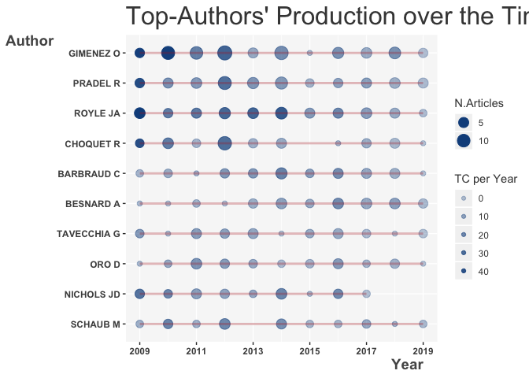

Network analyses
----------------

Collaboration network. Below is an author collaboration network, where
nodes represent top 30 authors in terms of the numbers of authored
papers in our dataset; links are co-authorships. The Louvain algorithm
is used throughout for clustering.

``` r
M <- metaTagExtraction(M, Field = "AU_CO", sep = ";")
NetMatrix <- biblioNetwork(M, analysis = "collaboration", network = "authors", sep = ";")
net <- networkPlot(NetMatrix, n = 30, Title = "Collaboration network", type = "fruchterman", size=TRUE, remove.multiple=FALSE,labelsize=0.7,cluster="louvain")
```

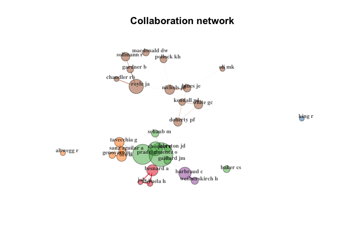

Country collaborations

``` r
NetMatrix <- biblioNetwork(M, analysis = "collaboration", network = "countries", sep = ";")
net <- networkPlot(NetMatrix, n = 20, Title = "Country collaborations", type = "fruchterman", size=TRUE, remove.multiple=FALSE,labelsize=0.7,cluster="louvain")
```

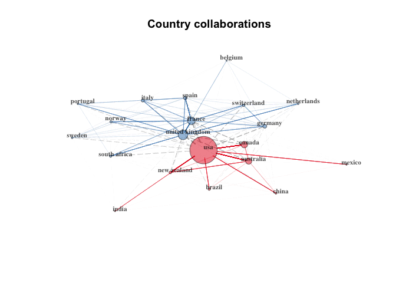

A keyword co-occurrences network

``` r
NetMatrix <- biblioNetwork(M, analysis = "co-occurrences", network = "keywords", sep = ";")
# Main characteristics of the network
netstat <- networkStat(NetMatrix)
summary(netstat, k = 10)
```

    ## 
    ## 
    ## Main statistics about the network
    ## 
    ##  Size                                  10867 
    ##  Density                               0.002 
    ##  Transitivity                          0.08 
    ##  Diameter                              6 
    ##  Degree Centralization                 0.192 
    ##  Average path length                   2.772 
    ## 

``` r
# Plot the network
net <- networkPlot(NetMatrix, normalize="association", weighted=T, n = 50, Title = "Keyword co-occurrences", type = "fruchterman", size=T,edgesize = 5,labelsize=0.7)
```

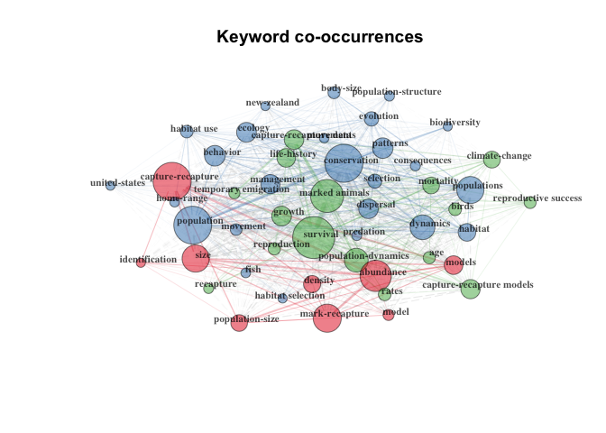

Co-citation network

``` r
# Create a co-citation network
NetMatrix <- biblioNetwork(M, analysis = "co-citation", network = "references", sep = ";")
# Plot the network
net <- networkPlot(NetMatrix, n = 10, Title = "Co-citation Network", type = "fruchterman", size=T, remove.multiple=FALSE, labelsize=0.7,edgesize = 5)
```

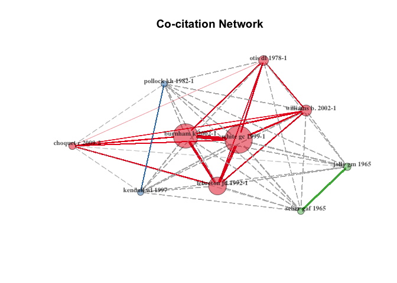

Topic modelling
---------------

### On abstracts

``` r
wordfabs <- dat %>%
  mutate(line = row_number()) %>%
  filter(nchar(AB) > 0) %>%
  unnest_tokens(word, AB) %>%
  anti_join(stop_words) %>%
  filter(str_detect(word, "[^\\d]")) %>%
  group_by(word) %>%
  mutate(word_total = n()) %>%
  ungroup() 
```

    ## Joining, by = "word"

``` r
desc_dtm <- wordfabs %>%
  count(line, word, sort = TRUE) %>%
  ungroup() %>%
  cast_dtm(line, word, n)
```

``` r
desc_lda <- LDA(desc_dtm, k = 20, control = list(seed = 42))
tidy_lda <- tidy(desc_lda)
```

``` r
top_terms <- tidy_lda %>%
  filter(topic < 13) %>%
  group_by(topic) %>%
  top_n(10, beta) %>%
  ungroup() %>%
  arrange(topic, -beta)

top_terms %>%
  mutate(term = reorder(term, beta)) %>%
  group_by(topic, term) %>%    
  arrange(desc(beta)) %>%  
  ungroup() %>%
  mutate(term = factor(paste(term, topic, sep = "__"), 
                       levels = rev(paste(term, topic, sep = "__")))) %>%
  ggplot(aes(term, beta, fill = as.factor(topic))) +
  geom_col(show.legend = FALSE) +
  coord_flip() +
  
  scale_x_discrete(labels = function(x) gsub("__.+$", "", x)) +
  labs(title = "Top 10 terms in each LDA topic",
       x = NULL, y = expression(beta)) +
  facet_wrap(~ topic, ncol = 4, scales = "free")
```

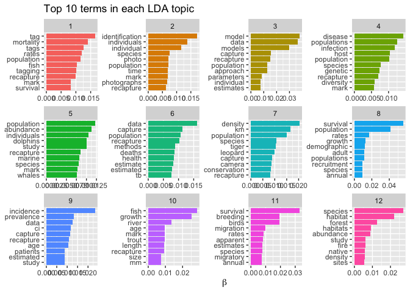

``` r
#ggsave('topic_abstracts.png', dpi = 600)
```

This is quite informative! Topics monitoring of marine mammals, fish biology, birds and migration, conservation of large carnivores (tigers, leopards), disease ecology, capture-recapture for social and medical sciences and disease ecology.


### On titles

``` r
wordft <- dat %>%
  mutate(line = row_number()) %>%
  filter(nchar(TI) > 0) %>%
  unnest_tokens(word, TI) %>%
  anti_join(stop_words) %>%
  filter(str_detect(word, "[^\\d]")) %>%
  group_by(word) %>%
  mutate(word_total = n()) %>%
  ungroup()
```

    ## Joining, by = "word"

``` r
desc_dtm <- wordft %>%
  count(line, word, sort = TRUE) %>%
  ungroup() %>%
  cast_dtm(line, word, n)
```

``` r
desc_lda <- LDA(desc_dtm, k = 8, control = list(seed = 42))
tidy_lda <- tidy(desc_lda)
```

``` r
top_terms <- tidy_lda %>%
  group_by(topic) %>%
  top_n(10, beta) %>%
  ungroup() %>%
  arrange(topic, -beta)

top_terms %>%
  mutate(term = reorder(term, beta)) %>%
  group_by(topic, term) %>%    
  arrange(desc(beta)) %>%  
  ungroup() %>%
  mutate(term = factor(paste(term, topic, sep = "__"), 
                       levels = rev(paste(term, topic, sep = "__")))) %>%
  ggplot(aes(term, beta, fill = as.factor(topic))) +
  geom_col(show.legend = FALSE) +
  coord_flip() +
  
  scale_x_discrete(labels = function(x) gsub("__.+$", "", x)) +
  labs(title = "Top 10 terms in each LDA topic",
       x = NULL, y = expression(beta)) +
  facet_wrap(~ topic, ncol = 4, scales = "free")
```

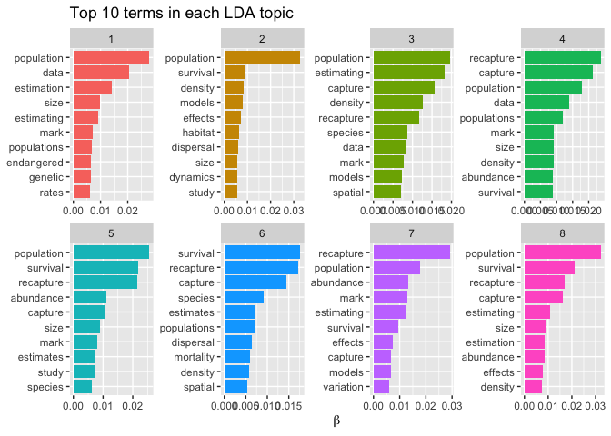

``` r
#ggsave('topic_titles.png', dpi = 600)
```
